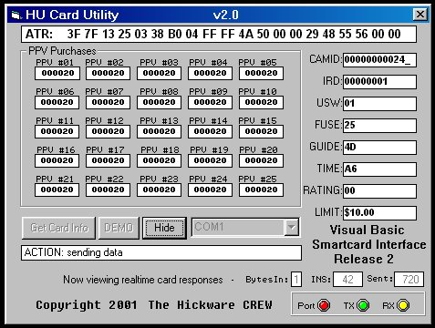



## Visual Basic Smartcard Interface 2

### Description

Source code release #2 that shows how to communicate with DSS smartcards of the P3 HU type also known as the "football" cards.
 
### More Info
 
You will need a smartcard reader/writer device connected to a serial communications port.

             |
---                |---
**Submitted On**   |2001-07-13 15:26:16
**By**             |[Head Hick Of The CREW](https://github.com/Planet-Source-Code/PSCIndex/blob/master/ByAuthor/head-hick-of-the-crew.md)
**Level**          |Advanced
**User Rating**    |4.6 (97 globes from 21 users)
**Compatibility**  |VB 5\.0, VB 6\.0
**Category**       |[Windows API Call/ Explanation](https://github.com/Planet-Source-Code/PSCIndex/blob/master/ByCategory/windows-api-call-explanation__1-39.md)
**World**          |[Visual Basic](https://github.com/Planet-Source-Code/PSCIndex/blob/master/ByWorld/visual-basic.md)
**Archive File**   |[Visual Bas227247132001\.zip](https://github.com/Planet-Source-Code/head-hick-of-the-crew-visual-basic-smartcard-interface-2__1-24992/archive/master.zip)

### API Declarations

Most of the serial API is demonstrated.

